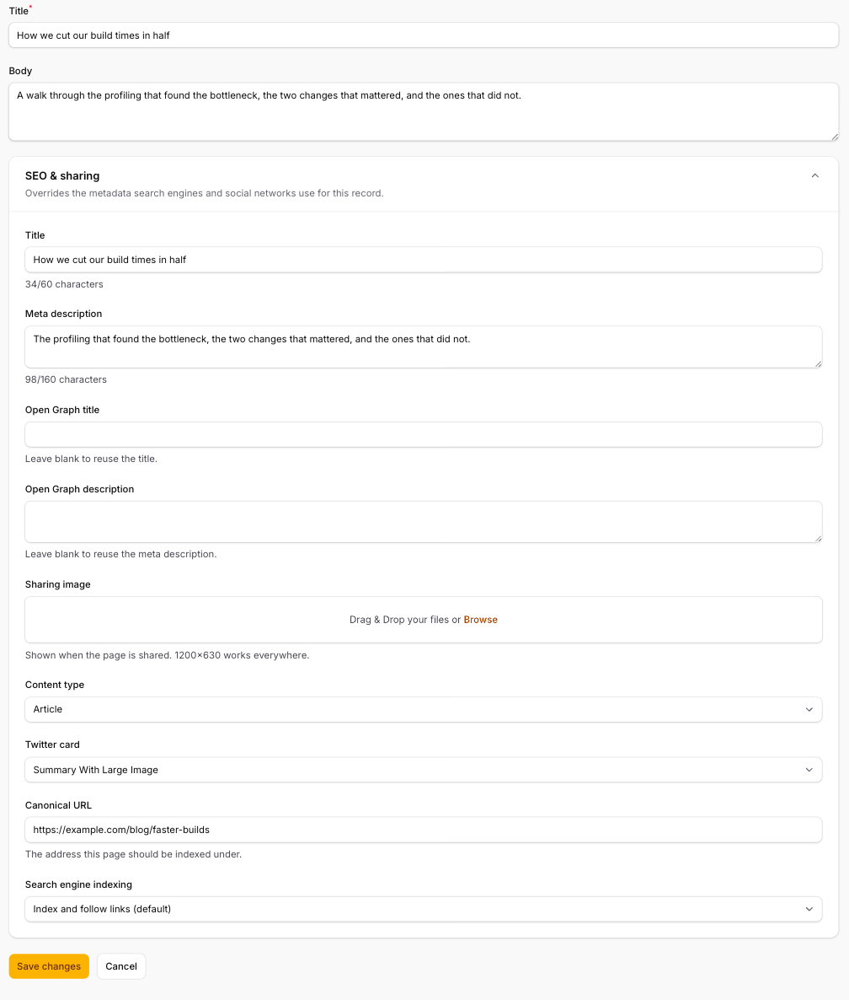
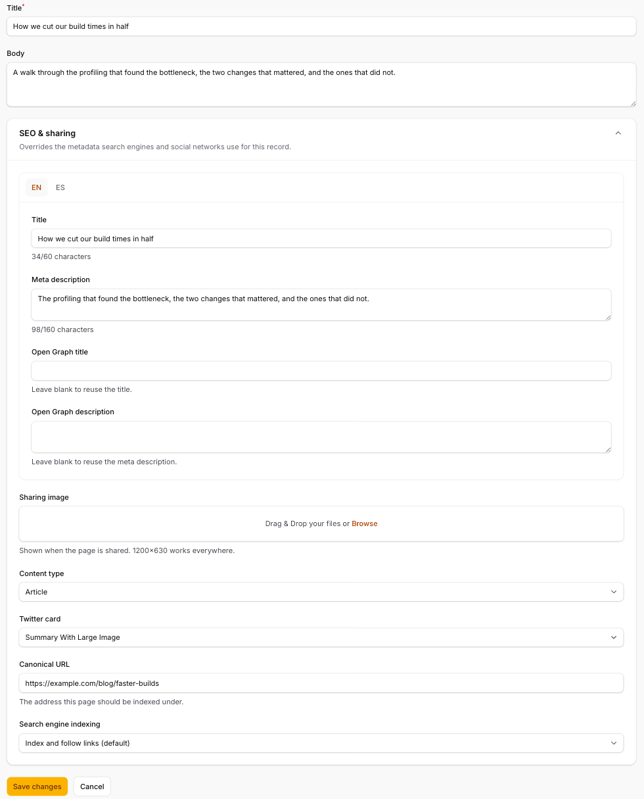

# Filament Head

[](https://github.com/buzkall/filament-head/actions/workflows/tests.yml)
[](https://github.com/buzkall/filament-head/actions/workflows/quality.yml)

Edit the metadata that search engines and social networks read — title, meta description, Open
Graph, canonical URL, robots — **per record, from a Filament panel**, and apply it on the public
site with one call.

Built on [`laravel/head`](https://github.com/laravel/head), Laravel's first-party head management
package. This is its first Filament integration.

```php
// In your resource's form:
HeadMetadataFields::make()

// In your public controller:
$post->applyHead();
```

Translatable per locale, translated into English, Spanish and Catalan.

| Default — one locale | With `locales` configured |
|---|---|
|  |  |
| A collapsible section at the foot of the form, with character counters on title and description. | One tab per locale for the four text fields; image, type, canonical and robots stay shared. |

---

## Requirements

| | |
|---|---|
| PHP | 8.3+ |
| Laravel | 13.17+ |
| Filament | 5 |
| `laravel/head` | 0.2 |

Laravel 13.17 is the floor because that is what `laravel/head` itself requires.

## Installation

```bash
composer require arzcode/filament-head
php artisan filament-head:install
```

The install command publishes the config file, publishes the migration that creates the
`head_metadata` table and offers to run it.

Your own tables are never touched — every record's metadata lives in one polymorphic table.

If you have not set up `laravel/head` yet, add its Blade directive to your public layout:

```blade
<head>
    @head
</head>
```

## Usage

Three steps, in the order you would do them.

### 1. Add the trait to the model

```php
use Arzcode\FilamentHead\Concerns\HasHeadMetadata;

class Post extends Model
{
    use HasHeadMetadata;
}
```

That gives the model a `headMetadata` relationship and an `applyHead()` method.

### 2. Add the section to the resource form

```php
use Arzcode\FilamentHead\Schemas\HeadMetadataFields;

public static function form(Schema $schema): Schema
{
    return $schema->components([
        TextInput::make('title'),
        RichEditor::make('body'),

        HeadMetadataFields::make(),
    ]);
}
```

It is a collapsible `Section`, full width, that drops in anywhere a form component fits. **No
changes to your Create or Edit page classes are needed** — the fields are bound to the
`headMetadata` relationship, which Filament persists along with the record.

### 3. Apply it on the public site

```php
public function show(Post $post): View
{
    $post->applyHead();

    return view('posts.show', ['post' => $post]);
}
```

`applyHead()` calls into `laravel/head` **only for values that are actually filled**. Everything
else keeps whatever your application's `Head::defaults()` set, so the package layers on top of
your site-wide metadata instead of blanking it.

## Fallbacks: `headDefaults()`

Admins will leave fields blank. Override `headDefaults()` to say what should be used when they
do — typically the record's own columns:

```php
use Arzcode\FilamentHead\Data\HeadDefaults;

public function headDefaults(): HeadDefaults
{
    return new HeadDefaults(
        title: $this->title,
        description: str($this->excerpt)->limit(160)->toString(),
        ogImage: $this->cover_url,
        ogType: 'article',
        canonicalUrl: route('posts.show', $this),
    );
}
```

A plain array works too, keyed by the same property names:

```php
public function headDefaults(): array
{
    return ['title' => $this->title, 'ogType' => 'article'];
}
```

Resolution is **per field**: a stored value wins, a blank stored value falls through to the
default, and a field with neither is not emitted at all.

## Translations

`title`, `description`, `og_title` and `og_description` are stored as JSON keyed by locale. The
remaining fields — image, type, canonical, robots — are stored once.

By default the form renders one untabbed set of fields for the application's current locale. List
more than one locale and it renders a tab per locale:

```php
// config/filament-head.php
'locales' => ['es', 'en', 'ca'],
```

```php
// or per resource
HeadMetadataFields::make()->locales(['es', 'en'])
```

At render time, `applyHead()` picks the value for the active locale, then the configured
`fallback_locale` (defaulting to `app.fallback_locale`), then the first non-empty translation.

No `spatie/laravel-translatable` dependency — these are plain `array` casts.

## Hiding fields

```php
HeadMetadataFields::make()->without(['twitter_card', 'robots'])
```

Any of `og_title`, `og_description`, `og_image`, `og_type`, `twitter_card`, `canonical_url`,
`robots` can be hidden. Title and description always render — passing either of them, or a name
that is not a field, throws a `LogicException` rather than quietly dropping the input.

## Configuration

`config/filament-head.php`:

| Key | Default | What it does |
|---|---|---|
| `disk` | `public` | Disk the sharing image is uploaded to. |
| `directory` | `head-metadata` | Directory within that disk. |
| `locales` | `null` | Locales offered in the form. `null` uses the active locale alone, untabbed. |
| `fallback_locale` | `null` | Locale used when the active one is blank. `null` uses `app.fallback_locale`. |
| `title_limit` | `60` | Recommended title length, shown as a counter. |
| `description_limit` | `160` | Recommended description length, shown as a counter. |

The limits are **hints, never validation** — a longer title still saves.

## The plugin (optional)

Registering the plugin is only needed to give one panel different settings from the config file:

```php
use Arzcode\FilamentHead\FilamentHeadPlugin;

$panel->plugin(
    FilamentHeadPlugin::make()
        ->locales(['es', 'en'])
        ->disk('media')
        ->directory('seo')
        ->titleLimit(55)
        ->descriptionLimit(150)
);
```

| Fluent method | Config key |
|---|---|
| `locales(array\|Closure)` | `locales` |
| `disk(string\|Closure)` | `disk` |
| `directory(string\|Closure)` | `directory` |
| `titleLimit(int\|Closure)` | `title_limit` |
| `descriptionLimit(int\|Closure)` | `description_limit` |

Precedence, highest first: `HeadMetadataFields::make()->locales(...)` → the plugin → the config
file.

**`applyHead()` never reads the plugin.** Your public site runs outside any panel, so there is no
plugin to read — the disk and fallback locale it uses always come from the config file. Keep them
consistent if you override the disk on a panel.

## FAQ

**Does it work without registering the plugin?**
Yes. The plugin only carries per-panel overrides. Add the trait and the form section and
everything works from `config/filament-head.php`.

**Which Laravel version?**
13.17 and up, because `laravel/head` requires it. There is no Laravel 12 build.

**Does it render anything itself?**
No. Rendering is entirely `laravel/head`'s `@head` directive in your layout. This package only
stores values and pushes them onto the current request.

**What happens to my `Head::defaults()`?**
They stay. `applyHead()` only calls the methods for fields that have a value, so an unset field
inherits your app-level default rather than being blanked.

**Can I use it on a model that is not exposed in a resource?**
Yes — the trait and `applyHead()` work with no panel involved. The Filament section is just the
editing UI.

**Is the canonical URL forced to HTTPS?**
No. Stored URLs are passed through with `forceHttps: false`, so an external or plain-`http`
canonical is emitted exactly as you typed it.

## Testing

```bash
composer test      # Pest
composer analyse   # Larastan, level 6
composer format    # Pint
```

## Trying it in one of your own projects

No need to publish anything. Point the project's `composer.json` at your local checkout with a
[path repository](https://getcomposer.org/doc/05-repositories.md#path):

```jsonc
"repositories": [
    {
        "type": "path",
        "url": "../filament-head",              // wherever you cloned it
        "options": { "symlink": true }          // true = edits apply instantly
    }
],
```

Then require it as a dev version and install as usual:

```bash
composer require arzcode/filament-head:@dev
php artisan filament-head:install
```

Remember to drop the `repositories` entry before deploying that project.

## Contributing

Pull requests are welcome. Please keep `composer test`, `composer analyse` and
`composer format --test` green, and add any new user-facing string to all three language files —
a test asserts they carry identical keys.

`laravel/head` is pre-1.0, so every call into it is deliberately confined to
`HasHeadMetadata::applyHead()`. Keep it that way: one method to update when its API moves.

## License

MIT. See [LICENSE](LICENSE).
